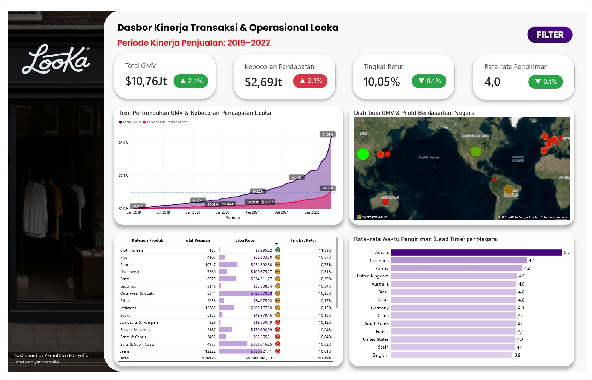

# 🛒 Looka E-Commerce: Dashboard Kinerja Transaksi & Operasional

> ⚠️ **Disclaimer:** Proyek ini adalah portofolio pribadi yang dibuat untuk tujuan demonstrasi kemampuan *Data Analytics*. Seluruh data yang digunakan dalam analisis ini bersumber dari dataset publik di **Kaggle**.

## 📌 Deskripsi Proyek
Proyek ini merupakan simulasi *end-to-end Data Analytics* yang merancang *executive dashboard* untuk menganalisis data transaksi dan operasional platform Looka E-Commerce periode 2019–2022. Tujuan utama proyek ini adalah melacak indikator kesehatan bisnis secara komprehensif, menyajikan data dalam jumlah besar menjadi *insight* bisnis dalam hitungan detik tanpa *visual clutter*.

🔗 **[Klik di sini untuk melihat Dashboard Interaktif](https://app.powerbi.com/view?r=eyJrIjoiMWNlMWNiMWQtYTZmZi00YzIxLWI3NzctZTJhYmQ4MjEyMDFmIiwidCI6IjkwYWZmZTBmLWMyYTMtNDEwOC1iYjk4LTZjZWI0ZTk0ZWYxNSIsImMiOjEwfQ%3D%3D)**
👉 **[Akses Dataset Lengkap (Raw & Processed) via Google Drive](https://drive.google.com/drive/folders/1AxpIPyPe_gSKuYnlEeaNwuJK2dDVyQWe?usp=drive_link)**

## 🛠️ Tech Stack & Tools
* **Python (Jupyter Notebook):** Exploratory Data Analysis (EDA) & Data Cleaning (Pandas)
* **Data Modeling:** Pembuatan model data menggunakan pendekatan *Star Schema* (Fact & Dimension Tables)
* **Power BI:** Visualisasi Interaktif, Kalkulasi DAX (Data Analysis Expressions), & *Advanced Conditional Formatting* (Azure Map)

## 📊 Business Insights Utama
Berdasarkan analisis visual yang mendalam pada *dashboard*, ditemukan beberapa *insight* strategis terkait operasional dan penjualan:

1. **Lonjakan Eksponensial vs Kebocoran Konstan:** Looka mencatatkan Total GMV sebesar $10,76 Juta. Terdapat lonjakan pertumbuhan transaksi yang sangat tajam (eksponensial) menjelang awal tahun 2022 yang menembus angka $1,08 Juta per bulan. Namun, di balik pertumbuhan agresif tersebut, indikator Kebocoran Pendapatan (*Revenue Leakage*) terus membayangi secara konstan dan menumpuk hingga $2,69 Juta, mengindikasikan adanya inefisiensi yang perlu segera disumbat seiring membesarnya skala bisnis.
2. **Paradoks Profitabilitas di Pasar Eropa:** Berdasarkan pemetaan spasial (*Azure Map*), kawasan Asia dan Amerika Utara menjadi penyumbang profitabilitas paling sehat (ditandai dengan gelembung hijau). Menariknya, wilayah Eropa menunjukkan anomali; meskipun memiliki klaster volume transaksi yang padat, mayoritas indikatornya berwarna merah, menandakan margin laba yang sangat tipis atau bahkan berpotensi merugi secara operasional di kawasan tersebut.
3. **Anomali Kualitas Kategori "Clothing Sets":** Secara global, tingkat retur (*Return Rate*) berhasil ditekan stabil di angka 10,05%. Namun saat dibedah lebih dalam, kategori *Clothing Sets* menduduki peringkat retur terburuk (11,89%) dengan kontribusi laba kotor yang sangat minim ($6.295). Sebaliknya, *Outerwear & Coats* tampil sebagai produk pahlawan (*hero product*) dengan sumbangsih laba tertinggi ($723 Ribu) pada tingkat retur yang jauh lebih aman.
4. **Efisiensi Rantai Pasok Logistik:** Secara keseluruhan, kinerja pengiriman Looka tergolong efisien dengan rata-rata *Lead Time* 4,0 hari. Austria menjadi satu-satunya negara yang mengalami *bottleneck* logistik terparah dengan durasi pengiriman hingga 5,5 hari, jauh tertinggal dibandingkan Belgia yang memimpin kecepatan pengiriman di angka 3,9 hari.

## 📂 Struktur Repositori
* `dashboard/`: Berisi file master Power BI (`.pbix`) dan tangkapan layar (screenshot) dasbor.
* `notebooks/`: Berisi *script* Python untuk proses *cleaning* dan transformasi data.
* `data/` *(Gitignored)*: Karena ukuran file melebihi batas unggah GitHub, folder berisi data mentah dan *processed* ini diabaikan dari repositori agar tetap ringan. Seluruh data dapat diakses melalui tautan Google Drive di atas.